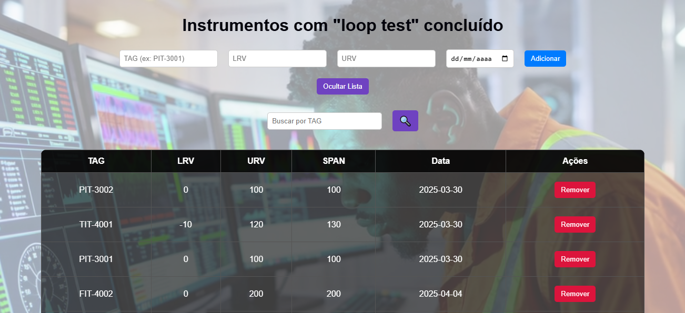

# 🌐 Front-End - Lista de Instrumentos com Loop Teste

Este é o front-end do MVP da sprint desenvolvimento Full Stack básico (PUC-Rio). A interface permite cadastrar, visualizar, buscar e remover instrumentos com loop test concluído, utilizando uma API REST desenvolvida em Flask.

🎯 O foco do loop test são instrumentos de medição das grandezas **nível (LIT), pressão (PIT), vazão (FIT)** e **temperatura (TIT)** de uma planta de processo qualquer. A interface foi projetada para funcionar de forma simples e visualmente clara, com suporte a interações diretas com a API.

---

## ✅ Funcionalidades

- 📥 Cadastrar novos instrumentos
- 📃 Listar todos os instrumentos cadastrados
- 🔍 Buscar instrumento por TAG
- 🗑️ Remover instrumento da lista
- 🎥 Vídeo de fundo para ambientação

---

## 🧰 Tecnologias utilizadas

- HTML5
- CSS3
- JavaScript (Vanilla)
- Fetch API para comunicação com o back end

---

## 📁 Estrutura do projeto

```
MVP-Bruno_Santos-Front-end/
│
├── README.md          # Este arquivo
├── background.mp4     # Vídeo de fundo
├── index.html         # Página principal com layout e estrutura do app
├── screenshot.png     # Imagem da interface em funcionamento
├── scripts.js         # Lógica JS: comunicação com API e DOM
└── styles.css         # Estilos visuais do sistema
```

---

## 🚀 Como executar

1. Certifique-se de que a **API está rodando** localmente em `http://localhost:5000`

2. Abra o arquivo `index.html` no seu navegador (clique duas vezes ou arraste para o navegador)

3. Teste os seguintes recursos:

   - Preencha os campos no formulário e clique em **"Adicionar"**
   - Clique em **"Exibir Lista"** para visualizar todos os instrumentos
   - Use a **busca por TAG** para consultar instrumentos individuais
   - Utilize o botão **"Remover"** para apagar um item da lista

---

## 🔄 Integração com a API

O front end se comunica com o seguinte back end:

📡 **URL base da API**: `http://localhost:5000`

Rotas utilizadas:

- **POST** `/instrumento` — Cadastrar novo instrumento
- **GET** `/instrumentos` — Listar todos os instrumentos
- **GET** `/instrumento?tag=...` — Buscar por TAG
- **DELETE** `/instrumento?tag=...` — Remover por TAG

---

## 💡 Observações

- O campo `SPAN` é automaticamente calculado e exibido com base em `URV - LRV`
- O vídeo de fundo pode ser substituído, se desejar outro visual

---

## 📷 Captura de tela

Abaixo, a interface do sistema em funcionamento:



---

## 🙌 Autor

Bruno Leonardo Ramos dos Santos  
🔗 [LinkedIn](https://www.linkedin.com/in/bruno-leonardo-ramos-dos-santos-31734b3a/)